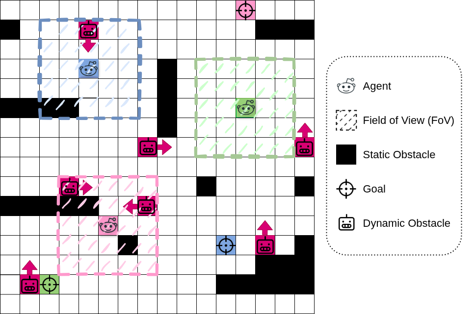

# **Dynamic and Partially Observable MAPF: An Extended Evaluation Integrating Informed Path Reuse and Context-Aware Planning**

## <div align="center">LNAI 2025</div>
## <div align="center">Paper ID: X </div>

## <u>Table of Contents</u>:
- [Overview](#overview)
  - [Project Description](#Project-Description)
  - [Key Features](#Key-Features)
- [Install](#install)
- [Usage](#usage)
  - [Usage of MAPF Scenario Generator](#command-line)
  - [Usage of A Metaheuristic and Hybrid Approach](#web-based-user-interface)
- [License](#license)

## Overview:


###  <u>Project Description</u>:
This project introduces an innovative solution for addressing the complex Dynamic and Partially Observable Multi-Agent Path-Finding (DPO-MAPF) problem encountered in challenging environments. The primary objective is to minimize total travel time while ensuring collision-free navigation among multiple agents.

###  <u>Approach</u>:
The proposed solution utilizes a bio-inspired metaheuristic technique known as Ant Colony Optimization (ACO) to facilitate efficient coordination and navigation among agents. 

The approach consists of two phases:

**1- _Centralized Offline Path Planning:_** In this phase, ACO is applied to perform centralized path planning. The goal is to minimize travel time and establish collision-free routes around static obstacles such as walls, mountains, and buildings.

**2- _Decentralized Online Repairs:_** Then, the solution addresses the challenges posed by dynamic and partially observable obstacles, including humans, vehicles, and other agents. Decentralized online repairs are carried out using the ACO to adaptively navigate around these obstacles.

### <u>Key Features</u>: 
* Encourages collaborative behavior among agents.
* Facilitates information exchange and self-organization.
* Provides a comprehensive solution for resolving the DPO-MAPF problem in complex environments.


## Install
> **_NOTE:_** This project is tested on [Python 3.10](https://www.python.org/downloads/release/python-31011/), Windows 10, and Ubuntu 18.04.  
> Creating a [virtual environment](https://docs.python.org/3.10/library/venv.html) is recommended.

You can install this Python project from scratch by following these steps:

1. Download the whole project from [GitHub](https://github.com/aniltrue/NegoLog).
2. Install [Python 3.10](https://www.python.org/downloads/release/python-31011/).
3. Install the required libraries via `pip`:
    ```bash
    pip install -r requirements.txt 
    ```
4. For Gurobi (v9.5.2), if you want to use the LP solver, download it from: [Gurobi Downloads](https://www.gurobi.com/downloads/).
5. You can run MAPF simulation and scenarios as described in [Usage](#usage).

### Additional Requirements
- **C++ Redistributable**: [Download Here](https://learn.microsoft.com/en-us/cpp/windows/latest-supported-vc-redist?view=msvc-170)

## Usage:
###  <u>Usage of MAPF Scenario Generator</u>:
The MAPF (Multi-Agent Path Finding) Framework allows for the simulation and evaluation of various scenarios related to the Dynamic and Partially Observable Multi-Agent Path-Finding (DPO-MAPF) task. To use the framework, follow these steps:

* **_Random Scenario Generator:_** This generator allows users to create random scenarios for the Multi-Agent Path Finding (MAPF) task. You can input parameters to customize the scenario:
    *  _N_: Map size
    *  _M_: Number of agents
    *  _D_: Number of dynamic obstacles
    *  _S_: Density of static obstacles
* **_Manual Scenario Generator:_** The manual scenario generator provides a graphical user interface (GUI) for creating MAPF scenarios. Users can input the map size manually, while the remaining parameters above can be adjusted through clicking or selection.
      
  ```bash
  scenario_maker.py 
  ```

<div align="center"> </div>

###  <u>Usage of A Metaheuristic and Multitier Approach</u>:
The ```SingleRun.py``` is a Python script, running a single simulation based on given arguments. For `Help`, you need to run:
```bash
  python SingleRun.py -h
```

Argument Options:
- **initial_algorithm**: Specifying *Centralized & Offline Path Planning* approach. The options are:
  - *single_aco*: Classical Ant Colony Optimizer
  - *cbs*: Pheromone-Based Multi-Agent Ant Colony Optimizer. It reduces the pheromone value of cells along the best paths identified by other agents.
  - *eecbs*: Obstacle-Based Multi-Agent Ant Colony Optimizer. It treats cells along the best paths of other agents as obstacles.
  - *lp*: Obstacle-Based Multi-Agent Ant Colony Optimizer. It treats cells along the best paths of other agents as obstacles.
- **protocol**: Specifying *Priority Protocol* for *Decentralized & Online Conflict Resolution*. The options are:
  - *random*: Random Protocol.
  - *token*: Fair Token Protocol. 
  - *probability*: Probability-Based Protocol
- *-agent_seed*: Random seed for ACO. If not specified, it will be random.
- **Map**: You can either load an existing scenario or randomly generate based on given parameters.
  - **load**: To load an existing scenario, a *path* must be specified. An example run is:
    ```bash
    python SingleRun.py [initial_algorithm] [protocol] load [FILE_PATH]
    ```
      > **Note**: The scenario must be a *Pickle* file.
  - **create**: To create a random map, some arguments should be specified:
    - *-n*: Map size (n x n), default = 5
    - *-m*: Number of agents, default = 3
    - *-d*: Static obstacle density, default = 0.1
    - *-number_of_dynamic_obstacles*: The number of dynamic obstacle. If not specified, it will equal to number of agents (m)
    - *-map_seed*: Random seed for map generation. If not specified, it will be random.
    Example run:
    ```bash
    python SingleRun.py [initial_algorithm] [protocol] create -n 5 -m 3 -d 0.1
    ```
      
      > **Note**: For ```Help```, you can run ```python SingleRun.py [initial_algorithm] [protocol] create -h```

- *--display*: Display the simulation via PyGame. Note that PyGame must be installed. Default = True
- *--gurobi*: Obtain the optimal value via Gurobi solver. Note that Gurobi must be installed. Default = False
- *--static*: Whether the simulation is *static* or *dynamic and partial observable*. Default = False 
  - If you want to **load** a *static* map, it must be defined as *False*. Otherwise, it must be *True*.
  - If you want to **create** a *static* map, it must be defined as *False*. Otherwise, it must be *True*.
  - Default value is *True*.

###  <u>For Parameter Tuning Experiments</u>:
  To start the *Parameter Tuning* experiments you can run the following Python script:
  ```bash
    python ParameterTuning.py
  ```

  > **Note**: The analysis and experiment data for parameter tuning in the paper exist in *parameter_tuning.xlsx*


###  <u>For Evaluation Experiments</u>:
  To start the *Evaluation* experiments you can run the following Python script:
  ```bash
    python RandomEvaluation.py
  ```

  > **Note**: The analysis and experiment data for evaluation in the paper exist in *analysis - final.xlsx*